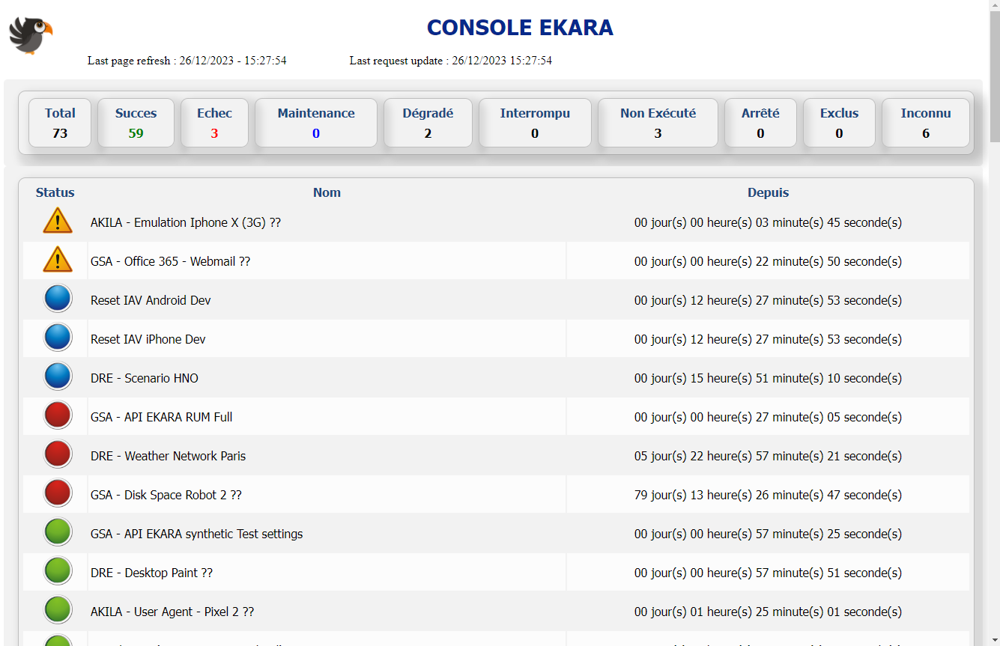
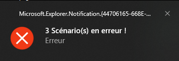
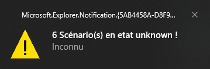

# Ekara-Console

<a href="https://api.ekara.ip-label.net/"> 

## Description
This [Powershell](https://learn.microsoft.com/powershell/scripting/overview) script lists all Ekara scenarios and displays their statuses in a dynamic web page.

For this, the script uses the Rest Ekara API [Ekara](https://ekara.ip-label.net/)

## Screens

## Requirements

-|version
--|:--:
Ekara plateform|>=23.12
PowerShell|>=5
.NET|>=4

(Account and password Ekara)

Before running the script, you must enter your Ekara identifier (Account / Password).

## Download

[github-download]: https://github.com/MrGuyTwo/Ekara-Console/releases
 - [`Ekara-Console`][github-download]

## The main function
API Methods called : 

- auth/login
- results-api/scenarios/status?clientId={$client}

After retrieving the status of all Eakra scenarios, the script generates a web page.

In the script, you can customize the following settings:
- RefreshPage (HTML page refresh time)
- IntervalInventory (Delay between each REST API request)
- customer (Ekara account ID)
- HTMLFile (HTML page name)

The script generates an alert for failed or degraded scenarios.

